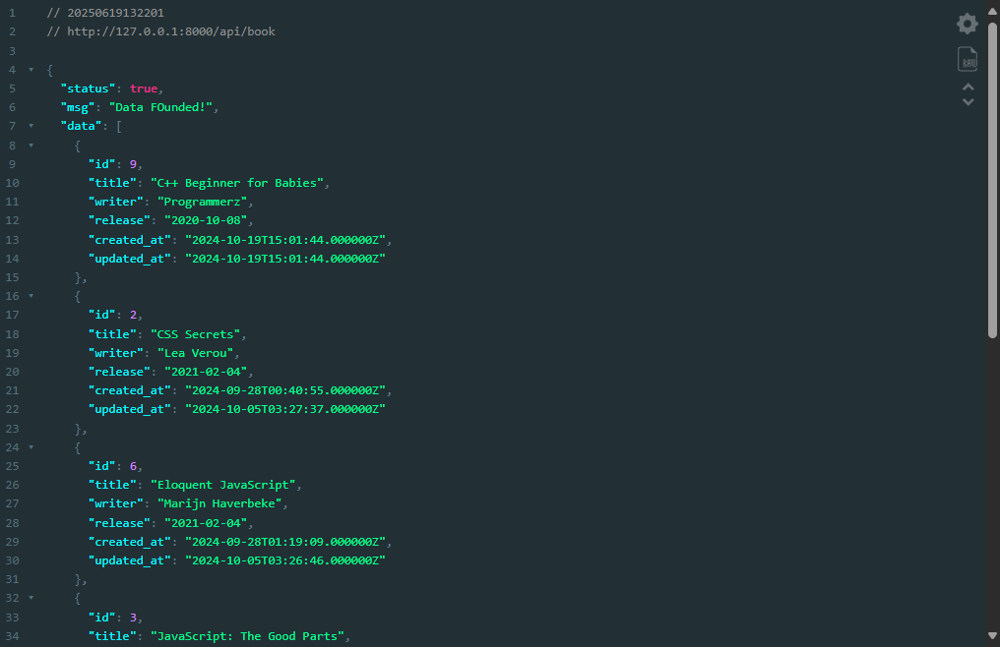
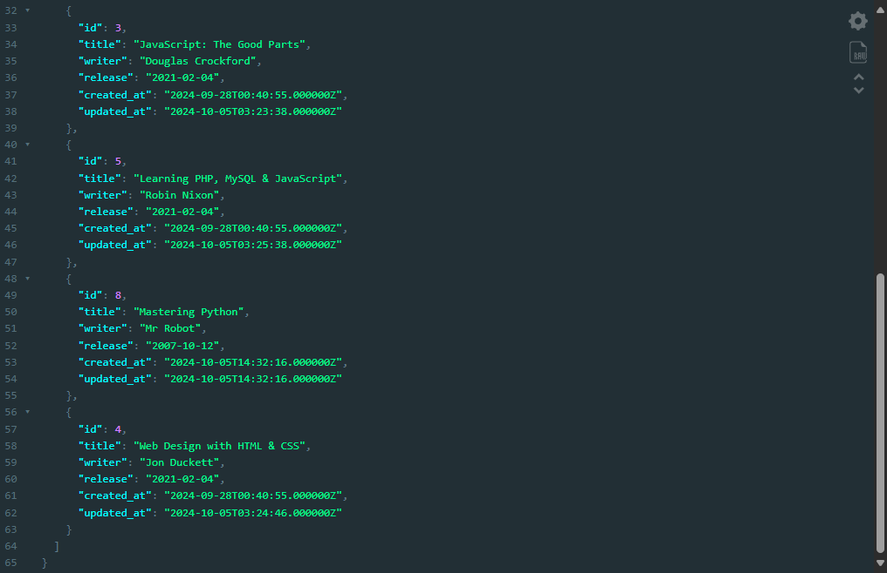
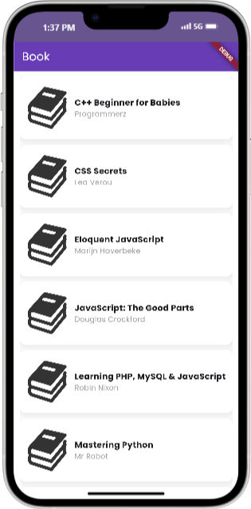

# Book API Laravel & Flutter

A simple demo project integrating **Laravel 11 REST API** for managing book data with a **Flutter** client for consuming the API.  
The backend is built with Laravel 11, providing RESTful endpoints to manage books, while the frontend is a Flutter application that interacts with the API to display and manage book data.

---

## Folder Structure
```
book-api-laravel-flutter
├── assets               # Contains images illustrating the API and Flutter app, which are displayed below.
├── flutter_restapi      # Flutter client app source code
└── restapi-laravel      # Laravel 11 REST API backend source code
```
---

## Features

- Laravel 11 REST API for CRUD operations on books
- Flutter app to consume the API
- Simple and clean integration between backend and frontend
- Demonstrates API consumption in Flutter with HTTP requests

---

## How to Clone and Use

### Prerequisites

- PHP and Composer installed (for Laravel backend)
- Laravel 11 installed or use Composer to create Laravel project
- Flutter SDK installed
- A database configured for Laravel (MySQL, SQLite, etc.)
- Android Studio or VS Code for Flutter development

### Clone the repository

```
git clone https://github.com/Ridhsuki/book-api-laravel-flutter.git
cd book-api-laravel-flutter
```

### Setup Laravel Backend

1. Navigate to the Laravel backend folder:

    ```
    cd restapi-laravel
    ```

2. Install dependencies:
    ```
    composer install
    ```

3. Configure your `.env` file with your database credentials.
   ```bash
   cp .env.example .env
   php artisan key:generate
   ```
4. Run migrations to create the books table:

    ```
    php artisan migrate
    ```

5. Start the Laravel development server:
    ```
    php artisan serve
    ```
The API will be available at <a href="http://localhost:8000/api/book">`http://localhost:8000/api/book`</a>.

### Setup Flutter Frontend

1. Navigate to the Flutter app folder:
    ```
    cd ../flutter_restapi
    ```
2. Install Flutter dependencies:
    ```
    flutter pub get
    ```
3. Run the Flutter app (connect a device or start an emulator):
    ```
    flutter run
    ```

Make sure the Flutter app is configured to point to the Laravel API URL (e.g., `http://localhost:8000/api`).

---

## API and Flutter App Images

### API Screenshot
<div style="display: flex; flex-wrap: wrap; gap: 10px; justify-content: center; align-items: center;" align="center">
      
      
</div>

### Flutter App Screenshot  
<div style="display: flex; flex-wrap: wrap; gap: 10px; justify-content: center; align-items: center;" align="center">
      
</div>

---

## Notes

- This project is ideal for learning how to integrate Laravel REST API with Flutter.
- You can extend the backend with authentication, validation, and more features.
- The Flutter app demonstrates basic API consumption including displaying and managing book data.

---

Feel free to explore, modify, and enhance this demo project!
